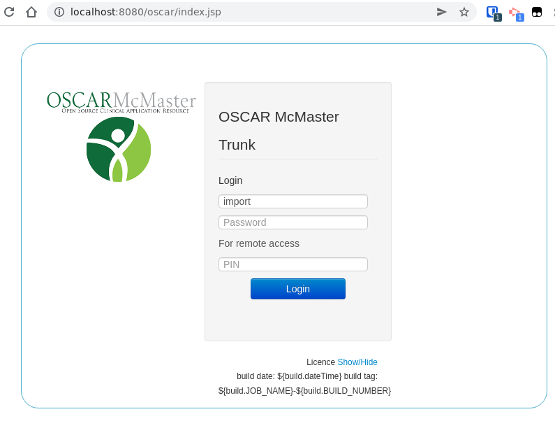

# OpenOSP Oscar 19 Setup

```
git clone https://github.com/open-osp/open-osp.git
cd open-osp
./openosp setup
```

(you can just hit ENTER at all prompts)

Then, edit your local.env (2nd/3rd lines) with

```
OSCAR_TREEISH="stable"
OSCAR_REPO="https://bitbucket.org/oscaremr/oscar.git"

LOCATION=ontario
```

Now run:

```
./openosp build oscar
./openosp bootstrap
./openosp start
```

go to localhost:8080 in your browser.



